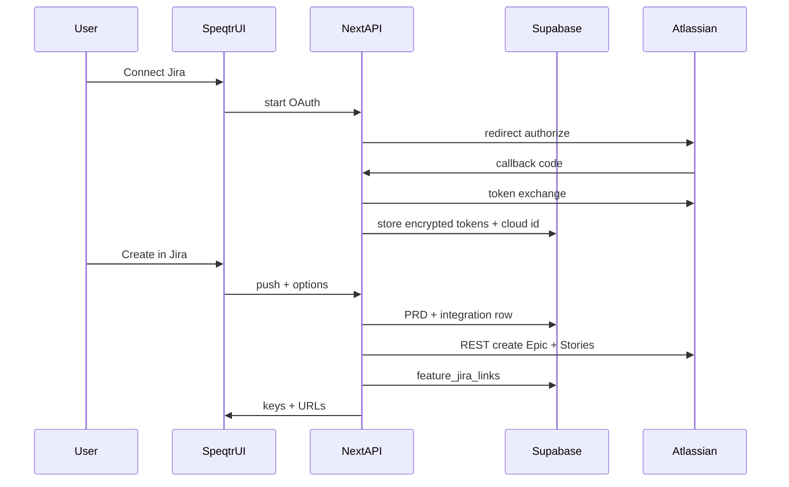

# Final plan: Jira Cloud integration (Speqtr)

## Goal

Let workspace users **connect Jira Cloud once**, then from a **feature with a PRD** run **Create in Jira** to create a **Jira Epic** and linked **Stories**, with **deep links** and **stored mapping** on the feature. **Scope: Jira Cloud only** (not Data Center). **Wire protocol: OAuth + REST** (not MCP for v1—see [Decision record](#decision-record)).

## Decision record

| Topic                  | Decision                                                                                                                                                                                                                                            |
| ---------------------- | --------------------------------------------------------------------------------------------------------------------------------------------------------------------------------------------------------------------------------------------------- |
| **Protocol**           | **Jira REST API v3** from Next.js after OAuth 3LO. MCP does not simplify in-browser product flows; it adds a client stack on top of the same auth.                                                                                                  |
| **MCP**                | **Out of v1.** Optional later: Atlassian Remote MCP only if an in-app agent benefits; not required for “Create in Jira”.                                                                                                                            |
| **Jira edition**       | **Cloud only** for v1.                                                                                                                                                                                                                              |
| **Connection scope**   | **Pick one before build:** (A) **per workspace** — one OAuth connection shared by the team; (B) **per user** — each PM’s Atlassian identity. Default recommendation: **per workspace** for simpler collaboration; document security (who can push). |
| **Local issues table** | **Not required for v1.** Push from PRD / artifact; add `feature_jira_links` for keys and idempotency hints. Full two-way sync is out of scope.                                                                                                      |
| **Repeat push**        | **Decide in implementation:** block second epic per feature unless user confirms “create new set”, or allow with strong confirmation.                                                                                                               |

## Phased delivery

**Phase A — Foundation:** DB tables, RLS, encrypted refresh token storage.

**Phase B — OAuth + Jira client:** Authorize/callback, refresh, `createmeta`, issue create, Epic↔Story linking (parent field vs Epic Link custom field per project type).

**Phase C — APIs:** Integration lifecycle + `POST .../jira/push` loading PRD from existing persistence (`[src/app/api/features/[id]/prd/route.ts](../../src/app/api/features/[id]/prd/route.ts)` patterns / Supabase).

**Phase D — Mapping:** MVP from PRD markdown heuristics; prefer follow-up **structured JSON artifact** for reliable stories (`[src/app/api/agents/prd/route.ts](../../src/app/api/agents/prd/route.ts)` ecosystem).

**Phase E — UI:** Settings/Integrations + wizard + preview + linked epic strip on feature (`[src/app/(main)/workspaces/[id]/WorkspaceDetailClient.tsx](../../src/app/(main)`/workspaces/[id]/WorkspaceDetailClient.tsx)).

**Phase F — Ops:** Atlassian OAuth app, env, staging test (HTTPS callback), docs, MEMORY.md.

## User journey (summary)

1. **Setup:** Settings → Connect Jira → Atlassian consent → Connected; optional default site + project.
2. **Work:** Same Speqtr flow → PRD ready on feature.
3. **Push:** Create in Jira → wizard (project, issue types) → preview → Create → epic key + Open in Jira.
4. **Ongoing:** Linked epic shown on feature; reconnect if token dies; disconnect clears Speqtr tokens only.

(Full step-by-step narrative lives in the historical plan thread; implementation details below are sufficient for engineering.)

## Architecture

## Data model

- `**jira_integrations**` (name flexible): `workspace_id` (or `user_id` if per-user), `connected_by_user_id`, Atlassian **cloud id** / site, **encrypted** `refresh_token`, expiry, scopes, timestamps.
- `**feature_jira_links`: `feature_id`, `epic_key`, `project_key` (optional), `story_keys` jsonb optional, `last_push_at`, `payload_hash` (optional, for “PRD changed” banner).

**Security:** tokens server-only; encrypt at rest (Vault/pgsodium or app key); RLS consistent with `[supabase/schema.sql](../../supabase/schema.sql)` + existing `[rls-policies.sql](../../supabase/rls-policies.sql)` patterns.

## API surface (Next.js)

| Route                                       | Purpose                                                          |
| ------------------------------------------- | ---------------------------------------------------------------- |
| `GET/POST /api/integrations/jira/authorize` | Start OAuth (PKCE, state)                                        |
| `GET /api/integrations/jira/callback`       | Exchange code, persist tokens                                    |
| `POST /api/integrations/jira/disconnect`    | Revoke/delete                                                    |
| `GET /api/integrations/jira/metadata`       | Sites/projects (cache-friendly)                                  |
| `POST /api/features/[id]/jira/push`         | Body: `projectKey`, optional issue type overrides, `storySource` |

Shared: `[src/lib/jira/](../../src/lib/jira/)` — refresh, authenticated fetch to `https://api.atlassian.com/ex/jira/{cloudId}/rest/api/3/...`.

## Frontend

- Workspace: **Integrations** — status, connect/reconnect/disconnect, defaults.
- Feature: **Create in Jira** — gated on connection; wizard + preview; post-success strip with **Open in Jira**.

Use existing Supabase session cookies via `fetch` to API routes (same as rest of app).

## Environment

- `ATLASSIAN_CLIENT_ID`, `ATLASSIAN_CLIENT_SECRET`
- `JIRA_OAUTH_REDIRECT_URI` (must match Developer Console)
- Server secret for token encryption (if not using Supabase Vault exclusively)

## Testing

- **Manual:** OAuth end-to-end on staging URL with valid HTTPS redirect.
- **Automated:** Unit tests for PRD → story list mapping; mock Atlassian HTTP in route tests.

## Out of scope (v1)

- Jira Data Center / Server
- Bi-directional sync (status changes in Jira → Speqtr)
- Bulk edit, custom fields beyond epic link/parent
- MCP / Rovo as the integration transport

## Files likely touched

- New: `src/lib/jira/`_, `src/app/api/integrations/jira/`_, `src/app/api/features/[id]/jira/push`(or`route.ts`under`jira/`)
- SQL: migration + RLS
- UI: workspace settings area, `WorkspaceDetailClient.tsx` (or small extracted components + CSS module)
- Docs: README or internal env checklist (minimal)

## References in repo

- Auth: `[src/lib/auth/require-user.ts](../../src/lib/auth/require-user.ts)`
- PRD API: `[src/app/api/features/[id]/prd/route.ts](../../src/app/api/features/[id]/prd/route.ts)`
- Schema: `[supabase/schema.sql](../../supabase/schema.sql)`
- Roadmap context: `[.cursor/plans/vp_pm_feature_roadmap_47c28ba2.plan.md](vp_pm_feature_roadmap_47c28ba2.plan.md)`
