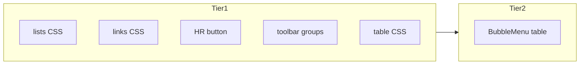

# PRD editor UX: lists, links, tables, dividers, color

## Root causes (recap)

- **Links invisible:** [`src/app/globals.css`](src/app/globals.css) sets `a { color: inherit; text-decoration: none; }`. TipTap uses [`docProseMirror`](src/app/(main)/workspaces/[id]/page.module.css) with **no** `a` override, so links match body text. Preview uses primary + underline but still low contrast.
- **Bullets invisible:** Tailwind Preflight sets `ol, ul, menu { list-style: none; }`. Document CSS adds padding but **does not restore** `list-style` for `.docProseMirror` / `.docPaperPreview`.
- **No text color:** Toolbar never added `@tiptap/extension-text-style` + `@tiptap/extension-color`.
- **Tables feel “dead”:** [`PrdDocumentEditor.tsx`](src/components/PrdDocumentEditor.tsx) only has an **Insert table** button. The underlying `@tiptap/extension-table` already exposes commands (`addRowBefore`, `addRowAfter`, `deleteRow`, `addColumnBefore`, `addColumnAfter`, `deleteColumn`, `deleteTable`, `mergeCells`, `splitCell`, `toggleHeaderRow`, etc.—see `node_modules/@tiptap/extension-table/dist/table/index.d.ts`) but **no UI** calls them.
- **No “beautification” / dividers:** StarterKit includes **horizontal rule** (`horizontalRule`) but there is **no toolbar control**; the toolbar is a flat row of buttons with only a bottom border—no **group separators** between logical sections (text style vs blocks vs table).

---

## Tier 1 — CSS + small toolbar (no new persistence risk)

| Item | What to do |
|------|------------|
| **Lists** | In [`page.module.css`](src/app/(main)/workspaces/[id]/page.module.css), under `.docProseMirror` and `.docPaperPreview`: `ul { list-style: disc; list-style-position: outside; }`, `ol { list-style: decimal; }`, `li { display: list-item; }`, nested variants (`ul ul { list-style: circle; }`), keep adequate `padding-left`. |
| **Links** | `.docProseMirror a` and stronger `.docPaperPreview a`: e.g. `color: var(--accent-color)`, underline, hover, `cursor: pointer`—scoped so global `a` does not apply inside the document panel. |
| **Horizontal rule** | Add toolbar button: `editor.chain().focus().setHorizontalRule().run()` (StarterKit). Style `.docProseMirror hr` / `.docPaperPreview hr` if needed (contrast on dark bg). |
| **Toolbar “beautification”** | Group buttons (e.g. Text \| Headings \| Lists \| Blocks \| Table \| Insert) with a thin vertical **separator** element between groups (new CSS class in `page.module.css`). Optional: subtle background on toolbar row. |
| **Table appearance** | Improve `.docProseMirror table` styling (row hover, zebra optional, clearer header background)—pure CSS; does not add row/column behavior by itself. |

---

## Tier 2 — Table editing UX (commands already exist)

**Goal:** Let users add/delete rows and columns without memorizing shortcuts.

**Recommended pattern:** [`BubbleMenu`](https://tiptap.dev/docs/editor/extensions/functionality/bubble-menu) from `@tiptap/react/menus`, shown when `editor.isActive('table')` (or when selection is inside a table cell—use `shouldShow` / `pluginKey` per TipTap docs). Contents: compact buttons or a small dropdown:

- Row: Add above, Add below, Delete row  
- Column: Add left, Add right, Delete column  
- Table: Delete table  
- Optional: Merge/split, Toggle header row  

**Dependencies:** Ensure `@tiptap/extension-bubble-menu` is installed if not already pulled transitively; add `BubbleMenu` next to `EditorContent` in [`PrdDocumentEditor.tsx`](src/components/PrdDocumentEditor.tsx).

**Alternative:** A **“Table” dropdown** in the main toolbar when `isActive('table')`, same commands—less discoverable than bubble but simpler.

**Markdown:** Existing HTML table → turndown GFM tables path should remain; verify after heavy table edits.

---

## Tier 3 — Optional: color / highlight (persistence)

- **Highlight:** `@tiptap/extension-highlight` + toolbar; may need turndown/marked tuning for `<mark>`.
- **Text color:** `TextStyle` + `Color` + toolbar; requires **turndown custom rules** (or accept inline HTML in stored markdown) so colors survive save/reload.

---

## Suggested implementation order

1. Tier 1: lists, links, HR button, toolbar separators, table CSS polish.  
2. Tier 2: BubbleMenu (or toolbar dropdown) for table row/column/table actions.  
3. QA: lists, links, HR, table CRUD, preview parity.  
4. Tier 3 if product wants color.

