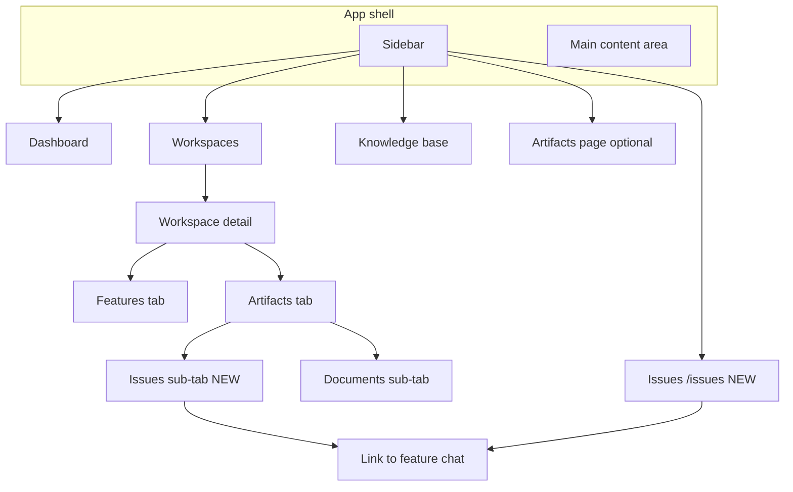
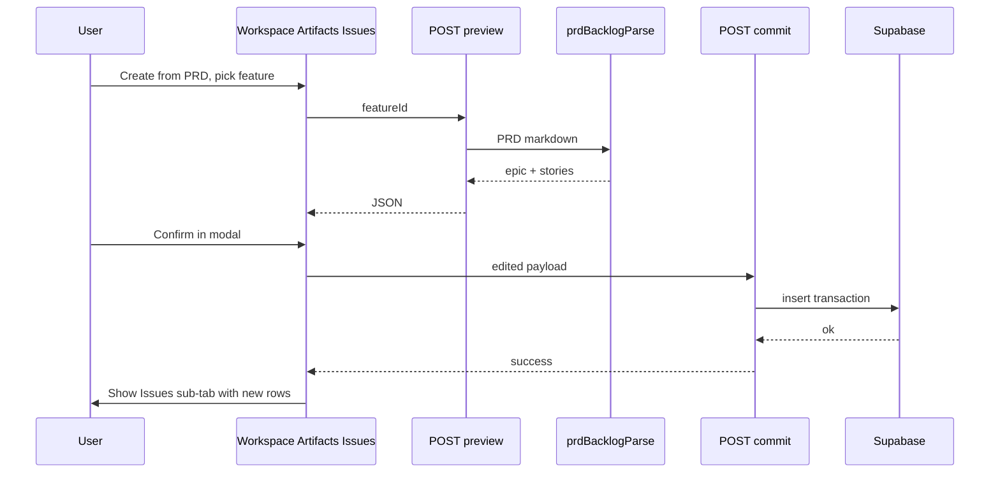

# PRD → Epic + Stories (complete plan)

## Goal

When a PM is satisfied with a PRD, they can **create structured work items** (one **Epic** + **Stories**) **without AI**: parse the existing Speqtr PRD markdown. **Epic** holds the PRD narrative (problem, goals, personas, etc.); each **Story** holds title, narrative, acceptance criteria, notes — analogous to Jira’s Epic vs Story, each with its own detail.

**UX principle:** Do **not** add tabs or heavy chrome to the **chat + document split** (that surface stays for inference, competitor, PRD editing). Issues are discovered and listed in **Artifacts → Issues** (workspace) and **Issues** (global nav).

---

## Context (codebase)

| Topic                                                               | Where                                                                                                |
| ------------------------------------------------------------------- | ---------------------------------------------------------------------------------------------------- | ----------------------------------------------------------------------------------------------------------------------------------- |
| PRD markdown contract (Epic section + User stories)                 | `[src/lib/agent-prompts.ts](src/lib/agent-prompts.ts)` — `PRD_OUTPUT_REQUIREMENTS`                   |
| Resolved PRD text (artifact first, legacy `prd_documents` fallback) | `[src/lib/artifact-persistence.ts](src/lib/artifact-persistence.ts)` — `resolvePrdContentForFeature` |
| PRD API                                                             | `[src/app/api/features/[id]/prd/route.ts](src/app/api/features/[id]/prd/route.ts)`                   |
| Workspace list: Features                                            | Artifacts                                                                                            | `[src/app/(main)/workspaces/[id]/WorkspaceDetailClient.tsx](src/app/(main)`/workspaces/[id]/WorkspaceDetailClient.tsx) (~1465–1602) |
| App sidebar                                                         | `[src/components/Sidebar.tsx](src/components/Sidebar.tsx)` — add **Issues** under Views              |
| Main shell                                                          | `[src/app/(main)/layout.tsx](src/app/(main)`/layout.tsx)                                             |

No `feature_issues` (or equivalent) table exists yet.

---

## Information architecture



| Surface                               | Route / state                                                           | What the user sees                                                                                                                                                                                                |
| ------------------------------------- | ----------------------------------------------------------------------- | ----------------------------------------------------------------------------------------------------------------------------------------------------------------------------------------------------------------- |
| **Global Issues**                     | `/issues`                                                               | All epics + stories across workspaces they own (RLS). Filter/search. Row opens detail; **Open feature** → `/workspaces/{wsId}?feature={featureId}`.                                                               |
| **Workspace → Artifacts → Issues**    | `/workspaces/{id}?view=artifacts&artifactsTab=issues` (param names TBD) | Same issue rows, **scoped to this workspace** (via `features.workspace_id`). Primary place for “what did we generate from PRDs here?”.                                                                            |
| **Workspace → Artifacts → Documents** | `view=artifacts`, documents sub-tab                                     | Today’s artifact table (PRD, inference, competitor exports) — unchanged behavior.                                                                                                                                 |
| **Feature chat + document**           | `?feature={id}`                                                         | Chat + PRD (or inference/competitor) panel. **No** backlog tab. At most one discreet action: e.g. **⋯ → Create issues from PRD** opening the same modal, or rely entirely on Artifacts → Issues + feature picker. |

---

## Layout wireframes (ASCII)

### A. App shell (any page)

```
┌──────────────────────────────────────────────────────────────────────────┐
│ SIDEBAR          │  MAIN                                                    │
│ Speqtr logo      │                                                          │
│ [Global search]  │   (page content)                                         │
│                  │                                                          │
│ Views            │                                                          │
│  Dashboard       │                                                          │
│  Workspaces      │                                                          │
│  Knowledge base  │                                                          │
│  Artifacts       │   ← existing global artifacts page (unchanged role)      │
│  Issues      NEW │   ← NEW: all issues across workspaces                   │
│                  │                                                          │
│ user@… Sign out  │                                                          │
└──────────────────┴──────────────────────────────────────────────────────────┘
```

### B. Workspace — Features tab (unchanged)

```
┌──────────────────────────────────────────────────────────────────────────┐
│  Acme Workspace                                                          │
│  [ Features ]  [ Artifacts ]                                             │
├──────────────────────────────────────────────────────────────────────────┤
│  Features                                                                │
│  [ Search… ]                                                             │
│  • Checkout redesign — Done · high                                       │
│  • SSO — Draft · medium                                                  │
└──────────────────────────────────────────────────────────────────────────┘
```

### C. Workspace — Artifacts tab with **Documents | Issues** sub-tabs

```
┌──────────────────────────────────────────────────────────────────────────┐
│  Acme Workspace                                                          │
│  [ Features ]  [ Artifacts ]                                             │
├──────────────────────────────────────────────────────────────────────────┤
│  Artifacts                                                               │
│  [ Documents ]  [ Issues ]     ← NEW sub-tabs (only under Artifacts)      │
├──────────────────────────────────────────────────────────────────────────┤
│  When "Documents": (current table) Kind | Title | Feature | Updated | …  │
│  When "Issues":    Key   | Type  | Title      | Status | Feature | …     │
│                    SPEQ-1  Epic  Checkout v2  Open     Checkout redesign  │
│                    SPEQ-2  Story Login flow   Open     Checkout redesign  │
│                    [ Create from PRD… ]  (picker: which feature)           │
└──────────────────────────────────────────────────────────────────────────┘
```

### D. Feature view — chat + PRD (keep uncrowded)

```
┌──────────────────────────────────────────────────────────────────────────┐
│  ← Workspace   Feature: Checkout redesign                    [ Split doc ]│
├──────────────────────────────┬───────────────────────────────────────────┤
│  CHAT                        │  Checkout redesign — PRD    Markdown       │
│  …messages…                  │  [ Save ] [ Export ▾ ] [ ✕ ]   optional: ⋯  │
│                              │  (no "Backlog" tab — at most ⋯ menu)        │
│                              ├───────────────────────────────────────────┤
│                              │  PRD editor / preview                     │
└──────────────────────────────┴───────────────────────────────────────────┘
```

### E. Global **Issues** page (`/issues`)

```
┌──────────────────────────────────────────────────────────────────────────┐
│  Issues                                                                  │
│  [ Search… ]  [ Workspace ▾ ]  [ Type ▾ ]  [ Status ▾ ]                 │
├──────────────────────────────────────────────────────────────────────────┤
│  Key      Type   Title              Status   Workspace    Feature        │
│  SPEQ-1   Epic   Checkout v2        Open     Acme          Checkout…     │
│  SPEQ-2   Story  SSO error copy     Open     Acme          SSO           │
├──────────────────────────────────────────────────────────────────────────┤
│  (click row)  →  DETAIL DRAWER or RIGHT PANE                               │
│  Title, description (markdown), AC list, status/priority                 │
│  [ Open workspace feature ]                                              │
└──────────────────────────────────────────────────────────────────────────┘
```

### F. **Create issues from PRD** modal (after preview API)

```
┌──────────────────────────────────────────────────────────────────────────┐
│  Create issues from PRD                                          [ ✕ ]   │
├──────────────────────────────────────────────────────────────────────────┤
│  Epic title: [ Checkout redesign — Epic                    ]               │
│  Epic description: (markdown preview of PRD body before User stories)    │
│                                                                          │
│  Stories                                                                 │
│  ☑  EP-01  Guest checkout                    [expand for AC…]            │
│  ☑  EP-02  Payment retry                   …                             │
│                                                                          │
│                           [ Cancel ]  [ Create issues ]                  │
└──────────────────────────────────────────────────────────────────────────┘
```

---

## Product behavior (step-by-step)

1. **Entry:** User opens **Artifacts → Issues** (workspace) and chooses **Create from PRD**, selects a **feature** that has a PRD (or is deep-linked from feature context with a minimal ⋯ action).
2. **Preview:** Client calls `POST /api/features/{featureId}/issues/preview` (no markdown in body for the default path). Server loads PRD using the **same “latest completed PRD” rule as the rest of the app** (see **Latest PRD guarantee** below), runs **deterministic** `prdBacklogParse`, returns proposed epic + stories (and optional warnings).
3. **Review:** Modal shows editable epic title, epic description (PRD “epic section” markdown), and a table of stories (checkbox include, inline title edit, expand for full narrative + AC).
4. **Commit:** `POST /api/features/{featureId}/issues/commit` with edited payload. **Transaction:** insert epic row then child story rows. **v1 rule:** one epic per feature; if rows already exist, require **confirm replace** (delete previous tree or soft-delete — pick one in implementation).
5. **Success:** Toast + navigate to `/workspaces/{wsId}?view=artifacts&artifactsTab=issues` (or refresh in place if already there).

**Parser errors:** Return `4xx` with actionable copy if no “User stories” section or zero parseable stories.

---

## Latest PRD guarantee (always the current saved version)

Issue creation must **never** silently use stale PRD text from an old tab, cached React state, or a previous artifact version.

| Rule                             | Detail                                                                                                                                                                                                                                                                                                                                                                          |
| -------------------------------- | ------------------------------------------------------------------------------------------------------------------------------------------------------------------------------------------------------------------------------------------------------------------------------------------------------------------------------------------------------------------------------- | ------------------------------------------------------------------------------------------------------------------------------------------------------------------------ |
| **Single source of truth**       | Preview and any server-side path use `**resolvePrdContentForFeature`** (or an equivalent helper that shares its logic): **latest completed** `feature_artifacts` row with `kind = 'prd'`, `is_draft = false`, ordered by `**version`descending** (tie-break`updated_at`/`created_at`). If none, fall back to `**prd_documents.content`** for that `feature_id`.                 |
| **No drafts**                    | Open **draft** PRD sessions (`is_draft = true`) are **not** used for issue parsing unless we explicitly add a separate “preview from draft” flow later. The **published** latest completed version is what matters for “the PRD we agreed on.”                                                                                                                                  |
| **Server-authoritative preview** | Default `**POST .../issues/preview`** loads markdown **only on the server from Supabase. The client does not send PRD body for the normal flow, so you cannot parse an outdated in-memory copy by mistake.                                                                                                                                                                      |
| **Unsaved editor changes**       | If the user has **unsaved** edits in the PRD panel (`savedPrd === false` / dirty editor), the UI must **either** (a) run **Save** (or autosave flush) **before** opening preview, **or** (b) show a blocking dialog: “Save your PRD to create issues from the latest version.” v1 recommendation: **save-then-preview** in one user gesture so the DB and preview always match. |
| **Artifacts → Issues entry**     | When starting from workspace **Artifacts → Issues** (no editor open), preview still uses **only** the server resolver — always latest completed version for the selected feature.                                                                                                                                                                                               |
| **Transparency (optional)**      | Preview API may return `prdSource: { kind: 'artifact'                                                                                                                                                                                                                                                                                                                           | 'legacy', version?: number, updatedAt: string }` so the modal subtitle can show e.g. “Parsed from PRD v3 · saved 2m ago” and the user can trust which revision was used. |

**Implementation note:** Reuse `[getLatestCompletedPrdRow](src/lib/artifact-persistence.ts)` / `[resolvePrdContentForFeature](src/lib/artifact-persistence.ts)` inside the preview route; do not duplicate ad-hoc queries that could drift from GET `/api/features/[id]/prd`.

---

## How PRD content becomes issues (no guessing, no AI)

The PRD is **one markdown string** resolved as in **Latest PRD guarantee** above. A **pure function** `prdBacklogParse(markdown)` runs on the server at **preview** time:

1. **Locate the split point** — Find the first markdown heading whose visible text is essentially “User stories” (after stripping numbering like `2.`). Everything **above** that heading is treated as the **Epic / PRD narrative**; everything **below** is the **stories region**.
2. **Build the Epic issue** — `description` = that pre-stories markdown, unchanged (so problem, goals, personas, tables, etc. stay intact). `title` = feature name from the database, or the first document title line if you need a fallback.
3. **Build Story issues** — Walk the stories region in order. Each story is a **contiguous block** (e.g. under a `###` heading, or starting at a line that looks like `**Story ID**:` / `EP-01`). For each block, **slice** subsections by label patterns the PRD template already uses (Title, Persona, narrative line starting with “As a”, numbered acceptance criteria, Notes). Map into DB fields: `title`, `description` (narrative + persona + notes as structured markdown or plain sections), `acceptance_criteria` as a **string array** parsed from numbered / GWT lists.

Nothing is **generated** at parse time: the parser only **cuts and labels** existing text. If a field is missing in the markdown, that field is empty or the story is flagged in `parseWarnings`.

---

## Reliability: “right every time” (what we can and cannot promise)

**You cannot mathematically guarantee** perfect extraction for **arbitrary** markdown, because the PRD is still **human- and LLM-authored prose** with variable headings and spacing. The plan does **not** rely on “hope”; it stacks several layers so outcomes are **predictable and safe**:

| Layer                                       | What it does                                                                                                                                                                                                                                                                                  |
| ------------------------------------------- | --------------------------------------------------------------------------------------------------------------------------------------------------------------------------------------------------------------------------------------------------------------------------------------------- |
| **1. Contract in one place**                | `[PRD_OUTPUT_REQUIREMENTS](src/lib/agent-prompts.ts)` already defines order: Epic block first, then User stories with Story ID, Title, Persona, narrative, AC, Notes. Parser + tests are aligned to that contract.                                                                            |
| **2. Deterministic parser + tests**         | Same input → same output. Unit tests with **canonical** output, **messy** variants, and **failure** docs catch regressions when you change parsing rules.                                                                                                                                     |
| **3. Optional machine anchors (strongest)** | Add invisible markdown markers to the PRD template, e.g. `<!-- speqtr:stories-start -->` / `<!-- speqtr:stories-end -->`. Parser **prefers anchors** when present → **reliable split** for all PRDs generated after the prompt change. Old PRDs without markers still use heading heuristics. |
| **4. Stricter prompt (medium)**             | Tighten the PRD agent text to require exact headings, e.g. a single `## User stories` and `### {ID} {Title}` per story — reduces LLM drift.                                                                                                                                                   |
| **5. Validation before response**           | Preview API returns `parseWarnings` (e.g. “story without AC”, “duplicate Story ID”) and rejects with `4xx` if there is **no** stories section or **zero** parseable stories after fallbacks.                                                                                                  |
| **6. Human review (mandatory gate)**        | The user **always** sees the proposed epic + stories in the modal and can **edit, uncheck, or fix** text before **Create issues**. Wrong parsing is caught here; nothing is written until they confirm.                                                                                       |
| **7. Idempotent feature rule**              | One epic tree per feature in v1; **replace** requires explicit confirmation so you never silently duplicate or corrupt rows.                                                                                                                                                                  |

**Bottom line:** “Right every time” means **(a)** for **template-following** PRDs, parsing is **repeatable and tested**; **(b)** for **edge cases**, the user **reviews** before commit; **(c)** optional **anchors + stricter prompt** push reliability toward **near-100%** for **new** generated PRDs without bringing AI back into the issue-creation step.

---

## Parsing implementation notes (no AI)

- **File:** `src/lib/prdBacklogParse.ts` (+ tests).
- **Split:** Prefer `<!-- speqtr:... -->` markers if present; else first heading whose text matches “User stories” (case-insensitive), e.g. `## User stories`, `## 2. User stories`.
- **Epic body:** Markdown _before_ the stories region (trimmed).
- **Stories:** Ordered blocks under `###` / `####` or blocks keyed by `**Story ID**:` / `EP-\d+`; extract ref, title, persona, “As a…” line, numbered AC, notes.
- **Tests:** Three fixtures — canonical template, slightly messy LLM output, unparseable doc.

---

## Data model (Supabase)

**Table `feature_issues`:**

- `id` uuid PK
- `feature_id` uuid NOT NULL → `features(id)` ON DELETE CASCADE
- `parent_id` uuid NULL → `feature_issues(id)` (NULL = epic root)
- `type` text CHECK (`epic` | `story`)
- `issue_key` text NOT NULL (unique per workspace **or** per feature — choose one; e.g. workspace-scoped `SPEQ-12` via sequence)
- `title` text NOT NULL
- `description` text (markdown)
- `acceptance_criteria` jsonb (string array) or text
- `status` text (e.g. `open`, `in_progress`, `done`)
- `priority` text
- `sort_order` int
- `created_at`, `updated_at` timestamptz

**Invariant v1:** At most one row per `feature_id` with `type = 'epic'` AND `parent_id IS NULL`.

**RLS:** Same pattern as other feature-scoped data: user can access rows where `feature_id` belongs to a `feature` whose `workspace_id` points to a `workspace` with `created_by = auth.uid()`. Mirror `[supabase/rls-policies.sql](supabase/rls-policies.sql)`.

**Types:** Update `[src/lib/database.types.ts](src/lib/database.types.ts)`.

---

## API routes

| Method / path                               | Purpose                                                                                                                                                    |
| ------------------------------------------- | ---------------------------------------------------------------------------------------------------------------------------------------------------------- |
| `POST /api/features/[id]/issues/preview`    | Load **latest completed** PRD via `resolvePrdContentForFeature`; parse → `{ epic, stories[], parseWarnings?, prdSource? }` (no client markdown by default) |
| `POST /api/features/[id]/issues/commit`     | Persist epic + selected stories                                                                                                                            |
| `GET /api/features/[id]/issues`             | Tree for feature (epic + children, ordered)                                                                                                                |
| `GET /api/issues`                           | All issues for current user + `workspace_id`, `workspace_name`, `feature_id`, `feature_name` (PostgREST or RPC with joins)                                 |
| `PATCH /api/features/[id]/issues/[issueId]` | Update title, description, status, priority, AC                                                                                                            |

All routes: `[requireUser](src/lib/auth/require-user.ts)` + server Supabase client.

---

## Implementation files (checklist)

| Action         | Path                                                                                                                                                                    |
| -------------- | ----------------------------------------------------------------------------------------------------------------------------------------------------------------------- |
| Schema + RLS   | `[supabase/schema.sql](supabase/schema.sql)`, `[supabase/rls-policies.sql](supabase/rls-policies.sql)`, optional migration SQL                                          |
| Parser + tests | `src/lib/prdBacklogParse.ts`, `src/lib/prdBacklogParse.test.ts` (or project test dir)                                                                                   |
| APIs           | `src/app/api/features/[id]/issues/preview/route.ts`, `.../commit/route.ts`, `.../route.ts` (GET), `.../[issueId]/route.ts` (PATCH); `src/app/api/issues/route.ts` (GET) |
| Modal          | `src/components/PrdToBacklogModal.tsx` (+ CSS module if needed)                                                                                                         |
| Workspace UI   | `[WorkspaceDetailClient.tsx](src/app/(main)`/workspaces/[id]/WorkspaceDetailClient.tsx) — sub-tabs under Artifacts, fetch issues, wire modal + URL params               |
| Global Issues  | `src/app/(main)/issues/page.tsx` (+ client component for table + detail)                                                                                                |
| Nav            | `[Sidebar.tsx](src/components/Sidebar.tsx)` — link to `/issues`                                                                                                         |
| Ship note      | `[MEMORY.md](MEMORY.md)`                                                                                                                                                |

---

## Out of scope (this phase)

- Jira / Linear / ADO **sync** (separate initiative; may align with `[jira_cloud_integration_final.plan.md](jira_cloud_integration_final.plan.md)` later).
- **LLM** parsing or story suggestions.
- **Kanban / board** across issues (v1 is **list + row detail** only).
- Changing the global `**/artifacts`** page into Issues (keep **Issues as its own nav + route for clarity).

---

## Diagram: data flow (create path)


