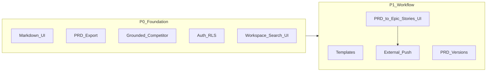

# VP Product: what to build next

## Where the product is today (research summary)

The codebase delivers an **AI workflow for turning a rough feature idea into a PRD**: workspaces → features (status/priority, purpose, requirements) → chat with **inference**, **competitor**, and **prd** agents → **1:1 `prd_documents` row** per feature. Chat is **persisted** in `[feature_messages](supabase/schema.sql)` with **pgvector + full-text search** and wired through `[assembleFeatureContext](src/lib/context.ts)` for retrieval on revisions.

Important gaps relative to real PM work:

- **No authentication or per-user tenancy** — APIs use shared Supabase access patterns; there is no `user_id` / org model in schema (`[schema.sql](supabase/schema.sql)`).
- **Competitor research is LLM-simulated**, not grounded in the web or proprietary sources (`[src/app/api/agents/competitor/route.ts](src/app/api/agents/competitor/route.ts)` + persona text in `[context.ts](src/lib/context.ts)`).
- **Chat UI renders markdown as plain text** (`[ChatInterface.tsx](src/components/ChatInterface.tsx)`); PRD viewing/editing is functional but not a full doc product (export/share not first-class from grep).
- **Single-feature focus** — strong for ideation→PRD, weak for portfolio roadmaps, dependencies, and cross-feature discovery.
- **No structured issue hierarchy** — PRD text and chat exist, but there is no first-class **epic → child stories** model or tracker-style backlog UI.

---

## Epic: PRD → issues (Jira/Linear-style)

**Goal:** After a PRD exists, the PM can **opt in** to generate a **parent Epic** and **child Issues** (stories/tasks) that mirror how Jira (Epic + linked Stories/Sub-tasks) and Linear (Project + Issues with parent/child or relations) structure work. The **default is not auto-create** — user explicitly chooses **“Generate issues from PRD”** (or similar) to avoid polluting the backlog on every draft.

### Product behavior

1. **Trigger:** CTA on the PRD panel or post-PRD chat state — e.g. “Generate backlog from PRD”. Disabled or gated until `prd_documents.content` is non-trivial / PRD agent marked done.
2. **Generation:** Server-side step (new agent or structured completion) that reads the PRD + feature context and returns a **proposed tree**: one **Epic** (title, summary, links to problem/goals) and **N child issues**, each with title, description, acceptance criteria bullets, suggested priority, and optional labels. Show a **review screen** (editable table or split list) so the PM can merge, rename, drop, or add rows before **commit**.
3. **Persistence:** New Supabase tables (conceptually):

- `issues` — `id`, `workspace_id`, `feature_id` (FK to the product feature), `parent_id` (nullable; null = epic root), `type` (`epic` `story` `task`), `key` (human-readable like `RUSHI-42`), `title`, `description`, `status`, `priority`, `sort_order`, timestamps.
- Optional: `issue_acceptance_criteria` as jsonb array on the row or child table.
- **Invariant:** at most one **epic** root per `feature_id` for v1 (simplest mental model: this feature’s PRD → one epic umbrella + children). Later: multiple epics per feature if needed.

1. **UI / UX (feel like Jira/Linear):**

- **Backlog list:** Dense table or list with columns (Key, Title, Type, Status, Priority), **grouped or indented** under the Epic; expand/collapse epic; status as colored pills; empty states and filters (All / Open / Done).
- **Issue detail:** Slide-over or right pane (Linear-like) or full page (Jira-like) with title, description (markdown), AC list, metadata, and **child issues** listed under the epic.
- **Visual language:** Neutral chrome, small caps section headers, subtle borders, hover rows, **command palette or `/`** later — match existing app shell but adopt **spacing, typography, and density** closer to Linear; **issue keys** and **status workflow** closer to Jira familiarity.

1. **Sync path (later P1/P2):** The same `issues` rows become the source of truth for **CSV/JSON export** and **Jira/Linear API** push (map epic to Jira Epic issue type; children to Story/Sub-task per your integration choice).

### Ties to codebase

- PRD source: `[prd_documents](supabase/schema.sql)`, `[WorkspaceDetailClient.tsx](src/app/workspaces/[id]/WorkspaceDetailClient.tsx)`.
- PRD agent already emits user stories in markdown — parser can prefer **structured sections** or use an LLM with **JSON schema** output for reliable parent/child creation.
- New routes: e.g. `POST /api/features/[id]/issues/generate` (propose), `POST /api/features/[id]/issues/commit` (save after review), `GET/PATCH` for CRUD.

---

## Strategic pillars (how to frame the roadmap)

1. **Trust & truth** — citations, real research, version history, and security so PMs can stand behind outputs in reviews.
2. **Workflow fit** — meet PMs where they work (issues, docs, comms) without forcing another silo.
3. **Collaboration** — PM is rarely solo; comments, review, and handoff matter as much as generation.
4. **Operational excellence** — cost, latency, failures, and data hygiene for embeddings and long chats.

---

## Prioritized backlog

### P0 — Ship confidence + daily usability (short horizon)

| Initiative                                                  | Why                                                                                                                                                       | Ties to codebase                                                                                                                                          |
| ----------------------------------------------------------- | --------------------------------------------------------------------------------------------------------------------------------------------------------- | --------------------------------------------------------------------------------------------------------------------------------------------------------- |
| **Markdown rendering in chat & PRD panel**                  | Agents already output markdown; plain text hurts scanability and trust.                                                                                   | `[ChatInterface.tsx](src/components/ChatInterface.tsx)`, PRD surface in `[WorkspaceDetailClient.tsx](src/app/workspaces/[id]/WorkspaceDetailClient.tsx)`. |
| **PRD export & share**                                      | PMs must paste into Confluence/Notion/Jira or email execs. Add Copy, Download `.md`, and optional “shareable read-only link” (even pre-auth).             | `[prd_documents](supabase/schema.sql)`, `[/api/features/[id]/prd](src/app/api/features/[id]/prd/route.ts)`.                                               |
| **Grounded competitor insights (optional web + citations)** | Today’s “competitor” step is explicitly simulated; PMs will discount it. Use a search/API tool path and require **cited sources** in the prompt contract. | `[competitor/route.ts](src/app/api/agents/competitor/route.ts)`, `[context.ts](src/lib/context.ts)` personas.                                             |
| **Auth + row-level security for multi-user**                | Required before any real team rollout; today anyone with deployment access effectively shares one data plane.                                             | New tables/columns + Supabase Auth; tighten `[rls-policies.sql](supabase/rls-policies.sql)` beyond anon-wide access.                                      |
| **Workspace-scoped search UI**                              | You already have `match_feature_messages` / `search_feature_messages` in SQL; expose **global search** across features in a workspace from the shell.     | `[context.ts](src/lib/context.ts)` `hybridSearch` / APIs — add a small `/api/workspaces/[id]/search` + UI entry point.                                    |

### P1 — PM workflow depth (medium horizon)

| Initiative                                     | Why                                                                                                                                                            |
| ---------------------------------------------- | -------------------------------------------------------------------------------------------------------------------------------------------------------------- |
| **Feature templates & PRD templates**          | Onboarding speed; enterprise PMs want “Bug report”, “Platform”, “Growth experiment” skeletons.                                                                 |
| **Versioned PRDs + diff**                      | Legal/compliance and eng handoff; store versions or git-like snapshots instead of single `content` overwrite.                                                  |
| **Stakeholder / review mode**                  | Read-only reviewer, inline comments on PRD sections, resolve threads — bridges chat agent output to human review.                                              |
| **Roadmap / portfolio view**                   | Kanban or table by status/priority across workspace; filters; optional **tags** (team, quarter, theme). Schema today is close (`features.status`, `priority`). |
| **Jira / Linear / Azure DevOps: push stories** | Parse or structure PRD output into issues (even MVP: “export user stories as CSV/JSON” before full API sync).                                                  |
| **Slack / email: notify on status change**     | Lightweight integration for “PRD ready for review”.                                                                                                            |

### P2 — Differentiation & scale (longer horizon)

| Initiative                                     | Why                                                                                                          |
| ---------------------------------------------- | ------------------------------------------------------------------------------------------------------------ |
| **Notion / Confluence bidirectional sync**     | Meets enterprise doc norms; reduces copy-paste.                                                              |
| **Figma / design links as first-class inputs** | Attach frames to a feature; include in `assembleFeatureContext`.                                             |
| **Analytics & cost dashboard**                 | Token/embeddings spend per workspace, time-to-PRD, agent funnel drop-off (inference → PRD completion).       |
| **Summarization / compaction jobs**            | Long threads blow context budgets; periodic “conversation summary” rows in `feature_messages` or side table. |
| **Multi-language & locale**                    | FTS today is `english`; product teams are global.                                                            |

---

## Fixes and hardening (always interleave with features)

- **API hardening**: rate limits, payload size limits, and structured error responses on agent routes (already `maxDuration` set; extend with quotas).
- **Idempotency / stream failure recovery**: you have `[PrdRecoveryBanner.tsx](src/components/PrdRecoveryBanner.tsx)` — extend pattern to inference/competitor partial streams.
- **PII / data retention**: retention policy for `feature_messages` embeddings and deletion UX (GDPR-style).
- **Observability**: trace IDs per feature session, log agent failures separately from user-visible chat.

---

## Suggested sequencing (VP call)

**Recommended order:** Markdown + PRD export first (fast PM delight), then **auth/RLS** if the next user is a team, else **grounded competitor** if the buyer cares about research credibility. **Workspace search UI** leverages existing DB work with relatively low lift. **PRD → epic/stories + tracker UI** is a strong P1 differentiator once PRD quality is trusted; **external Jira/Linear push** follows once the in-app issue model is stable.

---

## Out of scope for this note

Detailed UX mocks, exact pricing model, Jira vs Linear as **first** external sync target, and whether v1 allows **multiple epics per feature** — discovery with your ICP (solo PM vs product trio vs enterprise).
