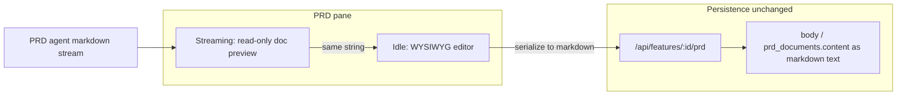

# WYSIWYG PRD document (no paid services)

## Current state

- PRD text lives in `[prd_documents.content](supabase/schema.sql)` and `[feature_artifacts.body](supabase/schema.sql)` as plain `text`; APIs in `[src/app/api/features/[id]/prd/route.ts](src/app/api/features/[id]/prd/route.ts)` read/write a `content` string.
- The right pane in `[src/app/workspaces/[id]/WorkspaceDetailClient.tsx](src/app/workspaces/[id]/WorkspaceDetailClient.tsx)` is a `**<textarea>**` bound to `prdDocument` (lines ~1238–1246)—users see **raw markdown**, not a rendered document.
- The PRD agent is instructed to output markdown (`[src/lib/agent-prompts.ts](src/lib/agent-prompts.ts)`); streaming updates `prdDocument` on every chunk via `[consumePrdStream](src/app/workspaces/[id]/WorkspaceDetailClient.tsx)` (~253–301).

## Recommendation (why not “real” .docx in the browser)

- **Native editable `.docx` in the browser** without a paid SaaS usually means **self-hosting** something like OnlyOffice/Collabora (extra containers, ops, and storage for binary files). That is a large jump for this app.
- **Better tradeoff for $0**: treat **markdown as the canonical format** (unchanged for the LLM and DB), and add a **Word-like editing surface** (headings, lists, tables, quotes) plus **document page styling** (max-width column, typography, print-like spacing). Optional later: **Export to .docx** using the open-source `[docx](https://www.npmjs.com/package/docx)` package (generate file on download—no subscription).

## Architecture

## Streaming vs editing (critical UX detail)

- Updating a full WYSIWYG model on **every stream token** resets selection and fights the layout engine.
- **Plan**: while PRD is streaming (`streamingRef` / PRD `isLoading` paths already exist), show a **read-only, document-styled markdown preview** (GFM tables, headings). When streaming ends, **hydrate** the rich editor from the final markdown string.
- **Autosave / sendBeacon** keep sending the same markdown string; no API contract change.

## Implementation steps

1. **Dependencies** (all MIT/open, no keys): add TipTap core packages plus table support for PRD-style tables, e.g. `@tiptap/react`, `@tiptap/starter-kit`, `@tiptap/pm`, and table extensions. For **markdown round-trip**, either:

- a maintained community bridge (e.g. `tiptap-markdown` if compatible with your TipTap major), or
- `**markdown-it` + `turndown` (or `marked` + `turndown`) with a small adapter: `markdown → HTML` on load, `editor HTML → markdown` on save—document the subset you support (headings, lists, tables, blockquotes, links, bold/italic, code blocks).

1. **New component** (e.g. `[src/components/PrdDocumentEditor.tsx](src/components/PrdDocumentEditor.tsx)`):

- Props: `value`, `onChange`, `streaming`, `disabled`.
- **Streaming branch**: render `react-markdown` + `remark-gfm` inside a styled “paper” container (reuse/extend classes in `[src/app/workspaces/[id]/page.module.css](src/app/workspaces/[id]/page.module.css)`).
- **Edit branch**: TipTap `EditorContent` with toolbar (bold, headings, lists, table insert if tables matter).
- On transition `streaming → false`, set editor content from latest `value` (guard against unnecessary resets when `value` is unchanged).

1. **Wire into** `[WorkspaceDetailClient.tsx](src/app/workspaces/[id]/WorkspaceDetailClient.tsx)`: replace the `<textarea>` with `PrdDocumentEditor`; keep `handleSavePrd`, `finalizePrdAndPersistAssistant`, and `consumePrdStream` passing **markdown strings** only.
2. **Accessibility / polish**: ensure the preview region is labeled (`aria-busy` during stream), and keyboard focus moves sensibly when switching modes.
3. **Optional follow-up** (not required for first ship): “Download .docx” button that converts the current markdown (or TipTap JSON) to a `.docx` blob via `docx` on the client or a small route handler.

## What stays the same

- `[src/lib/agent-prompts.ts](src/lib/agent-prompts.ts)` and inference parsing (`[src/lib/postInferenceQuestions.ts](src/lib/postInferenceQuestions.ts)`)—still markdown from the model.
- DB schema and `[artifact-persistence](src/lib/artifact-persistence.ts)` text storage; `mime_type` can remain `text/markdown`.

## Risk / mitigation

- **Markdown fidelity**: complex markdown from the model (nested lists, tight tables) may not round-trip perfectly through HTML; mitigate with GFM-capable parsers and manual tests on a few real PRD outputs; add a **“Source”** collapsible or tab with a plain textarea for power users if needed.
